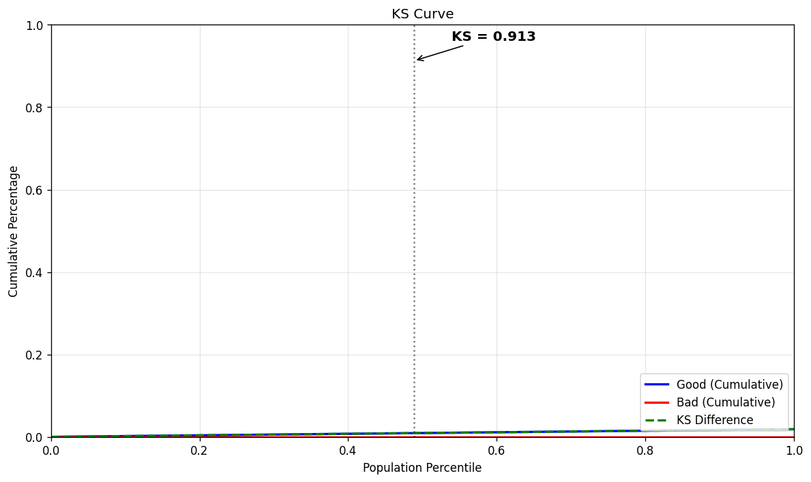
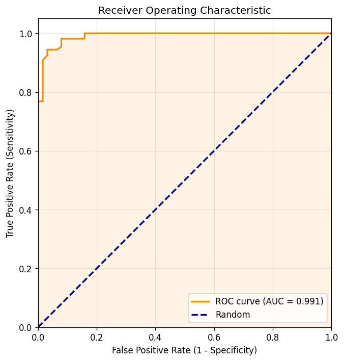
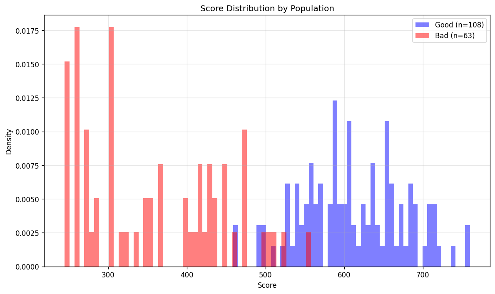
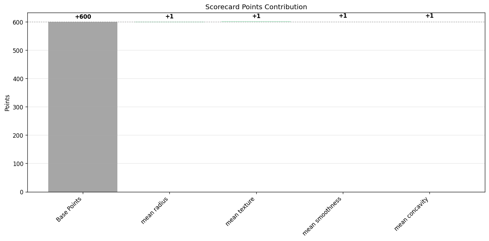
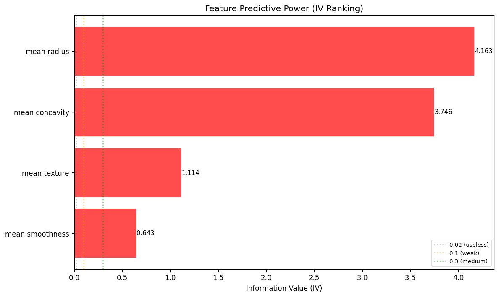

# ScoreCardModel

[](LICENSE)
[]()
[]()

**A professional toolset for scorecard modeling, fully compatible with scikit-learn.** Designed for credit risk analysts and data scientists who need transparent, regulator-friendly scoring models.

## Features

- **Scikit-learn API —** `BinningTransformer`, `WOETransformer`, and `ScoreCardTransformer` work in any `Pipeline` or `GridSearchCV`
- **5 WOE Methods —** Standard, Adjusted (Laplace), Empirical Logit, Signed, Weighted
- **Advanced Binning —** Quantile, Uniform, Optimal (via `optbinning`), Tree-based
- **Analyst Facade —** `ScoreCardWrapper` for familiar analyst workflows
- **16+ Plot Types —** KS, ROC, CAP, Gain/Lift, Calibration, PSI Drift, WOE Pattern, IV Ranking, Scorecard Heatmap, Cutoff Optimization, and more
- **Automated HTML Report —** One-line `generate_report()` produces a multi-page professional report
- **Feature Selection —** IV-based filtering, correlation deduplication, ranked diagnostics
- **Model Templates —** `BaseScorecard` / `ConservativeScorecard` for quick starts

## Visual Gallery

| KS Curve | ROC Curve | CAP Curve |
|---|---|---|
|  |  |  |

| Score Distribution | Scorecard Waterfall | IV Summary |
|---|---|---|
|  |  |  |

[See all 12+ visualizations →](docs/examples.md#visualizations)

## Installation

```bash
pip install scorecard-toolkit
```

## Quick Start

```python
from ScoreCardModel import ScoreCardWrapper

sc = ScoreCardWrapper(binning_strategy='quantile', base_points=600, pdo=20)
sc.fit(X_train, y_train)

scores = sc.predict(X_test)
card = sc.export_scorecard()
print(card.head(10))
```

## Documentation

| Guide | Description |
|---|---|
| [Installation](docs/installation.md) | pip, uv, dev setup |
| [Quickstart](docs/quickstart.md) | 5 ways to use the package |
| [Full Examples](docs/examples.md) | Code + real output + plots |
| [Visualizations](docs/examples.md#visualizations) | KS, ROC, CAP, heatmaps, and more |
| [WOE Guide](docs/woe_in_depth.md) | WOE methods, diagnostics, IV |
| [Best Practices](docs/best_practices.md) | Regulatory scorecard guidelines |
| [API Reference](docs/api.md) | Class and function reference |

## License

MIT
