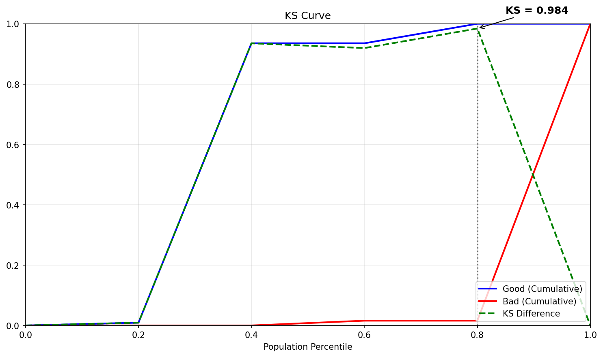
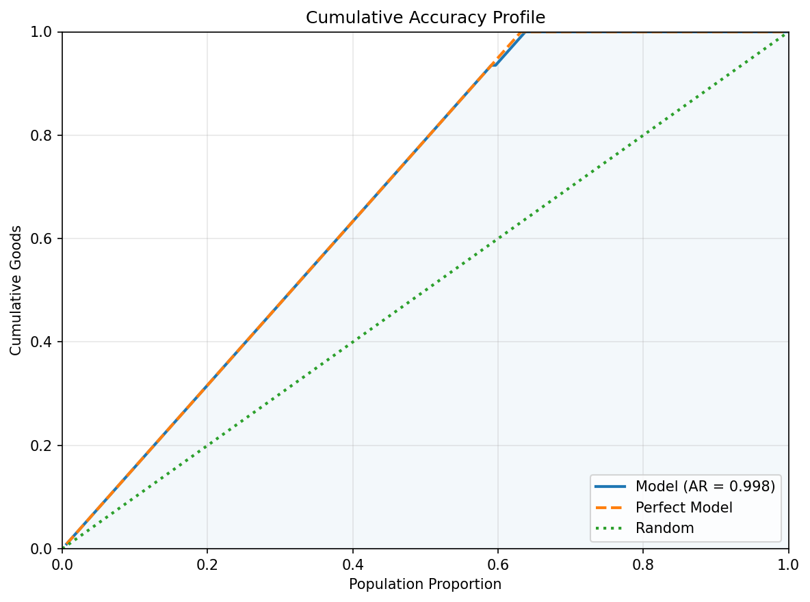
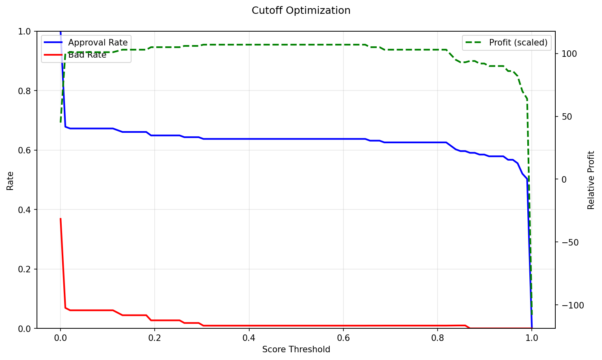

# Scorecard Model Report

## Summary Metrics

| Metric | Value |
|--------|-------|
| KS Statistic | 0.984 |
| AUC | 0.999 |
| Features | 30 |

## Model Performance

### Score Distribution: Good vs Bad

### KS Curve

### ROC Curve

### Cumulative Accuracy Profile (CAP)

## Feature Analysis

### Feature IV Ranking

## Scorecard

| Variable                | Bin                |         WOE |   Points |
|:------------------------|:-------------------|------------:|---------:|
| mean radius             | (-inf, 11.454]     |  2.58669    |    36.37 |
| mean radius             | (11.454, 12.744]   |  1.91466    |    31.13 |
| mean radius             | (12.744, 14.042]   |  0.930384   |    23.46 |
| mean radius             | (14.042, 17.072]   | -0.838732   |     9.68 |
| mean radius             | (17.072, inf]      | -4.48112    |   -18.7  |
| mean texture            | (-inf, 15.674]     |  2.10856    |    63.29 |
| mean texture            | (15.674, 17.872]   |  0.836854   |    34.9  |
| mean texture            | (17.872, 19.83]    | -0.090093   |    14.2  |
| mean texture            | (19.83, 21.976]    | -0.714054   |     0.27 |
| mean texture            | (21.976, inf]      | -1.17632    |   -10.05 |
| mean perimeter          | (-inf, 73.708]     |  2.93598    |    -9.47 |
| mean perimeter          | (112.4, inf]       | -4.48112    |    55.41 |
| mean perimeter          | (73.708, 82.124]   |  1.91466    |    -0.54 |
| mean perimeter          | (82.124, 90.992]   |  1.01223    |     7.36 |
| mean perimeter          | (90.992, 112.4]    | -0.942402   |    24.46 |
| mean area               | (-inf, 402.86]     |  2.58669    |    37.14 |
| mean area               | (402.86, 498.2]    |  2.09523    |    33.16 |
| mean area               | (498.2, 607.18]    |  0.852479   |    23.11 |
| mean area               | (607.18, 916.24]   | -0.838732   |     9.43 |
| mean area               | (916.24, inf]      | -4.48112    |   -20.04 |
| mean smoothness         | (-inf, 0.0841]     |  1.50758    |    36.24 |
| mean smoothness         | (0.0841, 0.0913]   |  0.490148   |    22.72 |
| mean smoothness         | (0.0913, 0.0988]   | -0.0588405  |    15.43 |
| mean smoothness         | (0.0988, 0.107]    | -0.485824   |     9.76 |
| mean smoothness         | (0.107, inf]       | -0.962811   |     3.42 |
| mean compactness        | (-inf, 0.0593]     |  2.10856    |   -39.44 |
| mean compactness        | (0.0593, 0.0788]   |  1.37913    |   -20.19 |
| mean compactness        | (0.0788, 0.109]    |  0.383959   |     6.08 |
| mean compactness        | (0.109, 0.144]     | -0.787579   |    37    |
| mean compactness        | (0.144, inf]       | -2.03388    |    69.9  |
| mean concavity          | (-inf, 0.0256]     |  3.45947    |    63.87 |
| mean concavity          | (0.0256, 0.045]    |  2.09523    |    45.08 |
| mean concavity          | (0.045, 0.0879]    |  1.01223    |    30.16 |
| mean concavity          | (0.0879, 0.15]     | -1.32854    |    -2.09 |
| mean concavity          | (0.15, inf]        | -2.94982    |   -24.43 |
| mean concave points     | (-inf, 0.0179]     |  4.57058    |    98.86 |
| mean concave points     | (0.0179, 0.0278]   |  2.5737     |    62.75 |
| mean concave points     | (0.0278, 0.0481]   |  1.39341    |    41.41 |
| mean concave points     | (0.0481, 0.0847]   | -1.4491     |    -9.99 |
| mean concave points     | (0.0847, inf]      | -4.48112    |   -64.82 |
| mean symmetry           | (-inf, 0.158]      |  1.19028    |     8.83 |
| mean symmetry           | (0.158, 0.172]     |  0.915      |    10.53 |
| mean symmetry           | (0.172, 0.185]     | -0.212333   |    17.53 |
| mean symmetry           | (0.185, 0.199]     | -0.485824   |    19.23 |
| mean symmetry           | (0.199, inf]       | -0.962811   |    22.19 |
| mean fractal dimension  | (-inf, 0.0567]     | -0.609671   |     0.37 |
| mean fractal dimension  | (0.0567, 0.0601]   |  0.690441   |    34.15 |
| mean fractal dimension  | (0.0601, 0.0628]   | -0.0588405  |    14.68 |
| mean fractal dimension  | (0.0628, 0.0672]   |  0.324742   |    24.65 |
| mean fractal dimension  | (0.0672, inf]      | -0.234073   |    10.13 |
| radius error            | (-inf, 0.221]      |  2.32239    |    84.84 |
| radius error            | (0.221, 0.281]     |  0.997076   |    45.68 |
| radius error            | (0.281, 0.354]     |  0.571393   |    33.1  |
| radius error            | (0.354, 0.538]     | -0.335377   |     6.3  |
| radius error            | (0.538, inf]       | -3.13021    |   -76.29 |
| texture error           | (-inf, 0.784]      |  0.571393   |    10.74 |
| texture error           | (0.784, 1.009]     | -0.284869   |    18.94 |
| texture error           | (1.009, 1.214]     | -0.262646   |    18.73 |
| texture error           | (1.214, 1.562]     | -0.234073   |    18.45 |
| texture error           | (1.562, inf]       |  0.266879   |    13.66 |
| perimeter error         | (-inf, 1.536]      |  2.58669    |     9.33 |
| perimeter error         | (1.536, 2.052]     |  1.08369    |    13.33 |
| perimeter error         | (2.052, 2.588]     |  0.444686   |    15.03 |
| perimeter error         | (2.588, 3.767]     | -0.485824   |    17.5  |
| perimeter error         | (3.767, inf]       | -2.65435    |    23.28 |
| area error              | (-inf, 17.018]     |  2.58669    |    60.05 |
| area error              | (17.018, 21.55]    |  1.75786    |    46    |
| area error              | (21.55, 28.904]    |  0.852479   |    30.66 |
| area error              | (28.904, 52.892]   | -0.736782   |     3.73 |
| area error              | (52.892, inf]      | -4.48112    |   -59.73 |
| smoothness error        | (-inf, 0.00487]    |  0.15467    |    18.05 |
| smoothness error        | (0.00487, 0.00587] | -0.182919   |    14.04 |
| smoothness error        | (0.00587, 0.00699] | -0.312649   |    12.5  |
| smoothness error        | (0.00699, 0.00878] |  0.0267574  |    16.53 |
| smoothness error        | (0.00878, inf]     |  0.324742   |    20.07 |
| compactness error       | (-inf, 0.0118]     |  1.19028    |   -21.17 |
| compactness error       | (0.0118, 0.0173]   |  0.915      |   -12.52 |
| compactness error       | (0.0173, 0.0245]   | -0.00657897 |    16.42 |
| compactness error       | (0.0245, 0.0349]   | -0.942402   |    45.8  |
| compactness error       | (0.0349, inf]      | -0.709003   |    38.48 |
| concavity error         | (-inf, 0.0134]     |  2.58669    |   -20.13 |
| concavity error         | (0.0134, 0.021]    |  1.27366    |    -1.68 |
| concavity error         | (0.021, 0.0306]    | -0.560218   |    24.08 |
| concavity error         | (0.0306, 0.0461]   | -0.838732   |    28    |
| concavity error         | (0.0461, inf]      | -0.911149   |    29.01 |
| concave points error    | (-inf, 0.00692]    |  1.92817    |    -0.62 |
| concave points error    | (0.00692, 0.00991] |  0.997076   |     7.51 |
| concave points error    | (0.00991, 0.0124]  | -0.00657897 |    16.27 |
| concave points error    | (0.0124, 0.0157]   | -0.838732   |    23.53 |
| concave points error    | (0.0157, inf]      | -1.17632    |    26.48 |
| symmetry error          | (-inf, 0.0147]     | -0.362406   |    10.73 |
| symmetry error          | (0.0147, 0.0172]   | -0.0792494  |    15.01 |
| symmetry error          | (0.0172, 0.0198]   |  0.100083   |    17.73 |
| symmetry error          | (0.0198, 0.0244]   |  0.306884   |    20.85 |
| symmetry error          | (0.0244, inf]      |  0.0463659  |    16.91 |
| fractal dimension error | (-inf, 0.00203]    |  0.571393   |    11.83 |
| fractal dimension error | (0.00203, 0.00278] |  0.490148   |    12.46 |
| fractal dimension error | (0.00278, 0.0036]  | -0.110502   |    17.06 |
| fractal dimension error | (0.0036, 0.00479]  | -0.535827   |    20.32 |
| fractal dimension error | (0.00479, inf]     | -0.312649   |    18.61 |
| worst radius            | (-inf, 12.774]     |  4.57058    |    -1.81 |
| worst radius            | (12.774, 14.084]   |  2.30923    |     7.1  |
| worst radius            | (14.084, 15.946]   |  0.930384   |    12.54 |
| worst radius            | (15.946, 20.336]   | -1.04841    |    20.35 |
| worst radius            | (20.336, inf]      | -5.59223    |    38.27 |
| worst texture           | (-inf, 20.098]     |  2.32239    |    87.14 |
| worst texture           | (20.098, 23.524]   |  0.997076   |    46.66 |
| worst texture           | (23.524, 26.502]   | -0.161641   |    11.27 |
| worst texture           | (26.502, 30.748]   | -0.736782   |    -6.29 |
| worst texture           | (30.748, inf]      | -1.23188    |   -21.41 |
| worst perimeter         | (-inf, 82.71]      |  4.57058    |   -13.85 |
| worst perimeter         | (105.58, 133.5]    | -1.23188    |    24.31 |
| worst perimeter         | (133.5, inf]       | -5.57973    |    52.91 |
| worst perimeter         | (82.71, 91.572]    |  2.92316    |    -3.01 |
| worst perimeter         | (91.572, 105.58]   |  1.01223    |     9.55 |
| worst area              | (-inf, 495.14]     |  4.57058    |   137.26 |
| worst area              | (1261.0, inf]      | -5.57973    |  -131.57 |
| worst area              | (495.14, 601.72]   |  2.09523    |    71.7  |
| worst area              | (601.72, 771.84]   |  1.09861    |    45.31 |
| worst area              | (771.84, 1261.0]   | -1.12173    |   -13.5  |
| worst smoothness        | (-inf, 0.112]      |  1.28815    |    48.59 |
| worst smoothness        | (0.112, 0.125]     |  0.690441   |    33.56 |
| worst smoothness        | (0.125, 0.137]     |  0.266879   |    22.92 |
| worst smoothness        | (0.137, 0.15]      | -0.485824   |     4    |
| worst smoothness        | (0.15, inf]        | -1.34639    |   -17.63 |
| worst compactness       | (-inf, 0.126]      |  2.32239    |    -0.88 |
| worst compactness       | (0.126, 0.184]     |  1.37913    |     6.06 |
| worst compactness       | (0.184, 0.252]     |  0.15467    |    15.07 |
| worst compactness       | (0.252, 0.365]     | -0.485824   |    19.79 |
| worst compactness       | (0.365, inf]       | -2.30981    |    33.21 |
| worst concavity         | (-inf, 0.0936]     |  2.93598    |   101.48 |
| worst concavity         | (0.0936, 0.18]     |  3.44681    |   116.32 |
| worst concavity         | (0.18, 0.286]      |  0.324742   |    25.64 |
| worst concavity         | (0.286, 0.415]     | -1.15745    |   -17.41 |
| worst concavity         | (0.415, inf]       | -2.41506    |   -53.93 |
| worst concave points    | (-inf, 0.0579]     |  3.45947    |    62.12 |
| worst concave points    | (0.0579, 0.0843]   |  2.92316    |    55    |
| worst concave points    | (0.0843, 0.122]    |  1.02715    |    29.84 |
| worst concave points    | (0.122, 0.176]     | -1.19449    |     0.36 |
| worst concave points    | (0.176, inf]       | -5.59223    |   -57.99 |
| worst symmetry          | (-inf, 0.243]      |  1.20477    |    49.22 |
| worst symmetry          | (0.243, 0.269]     |  0.746011   |    36.65 |
| worst symmetry          | (0.269, 0.294]     |  0.21023    |    21.97 |
| worst symmetry          | (0.294, 0.322]     | -0.234073   |     9.8  |
| worst symmetry          | (0.322, inf]       | -1.59304    |   -27.44 |
| worst fractal dimension | (-inf, 0.0695]     |  0.507098   |    16.06 |
| worst fractal dimension | (0.0695, 0.0768]   |  0.690441   |    16    |
| worst fractal dimension | (0.0768, 0.0831]   |  0.324742   |    16.11 |
| worst fractal dimension | (0.0831, 0.0951]   | -0.234073   |    16.28 |
| worst fractal dimension | (0.0951, inf]      | -1.12173    |    16.55 |

### Scorecard Points Heatmap

## Calibration & Cutoff

### Calibration Curve

### Cutoff Optimization

