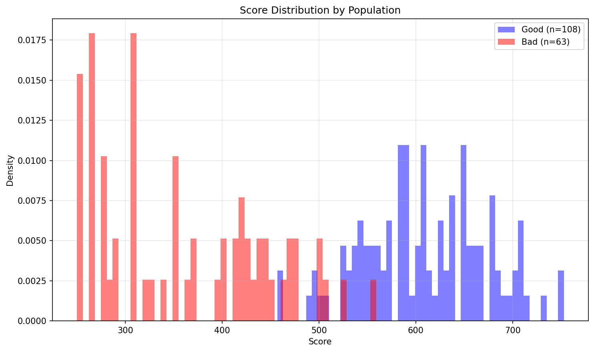
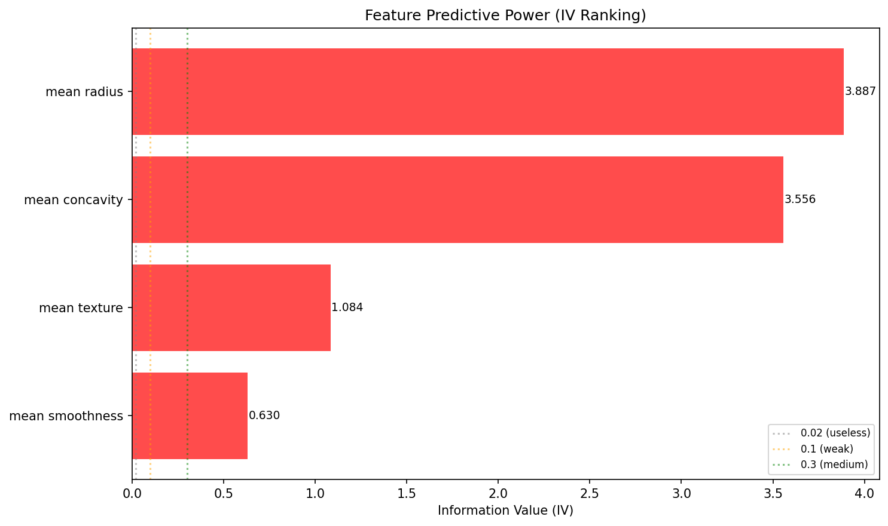
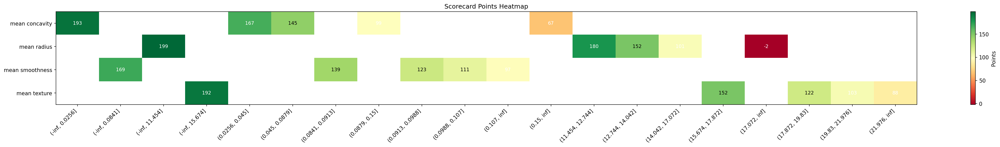
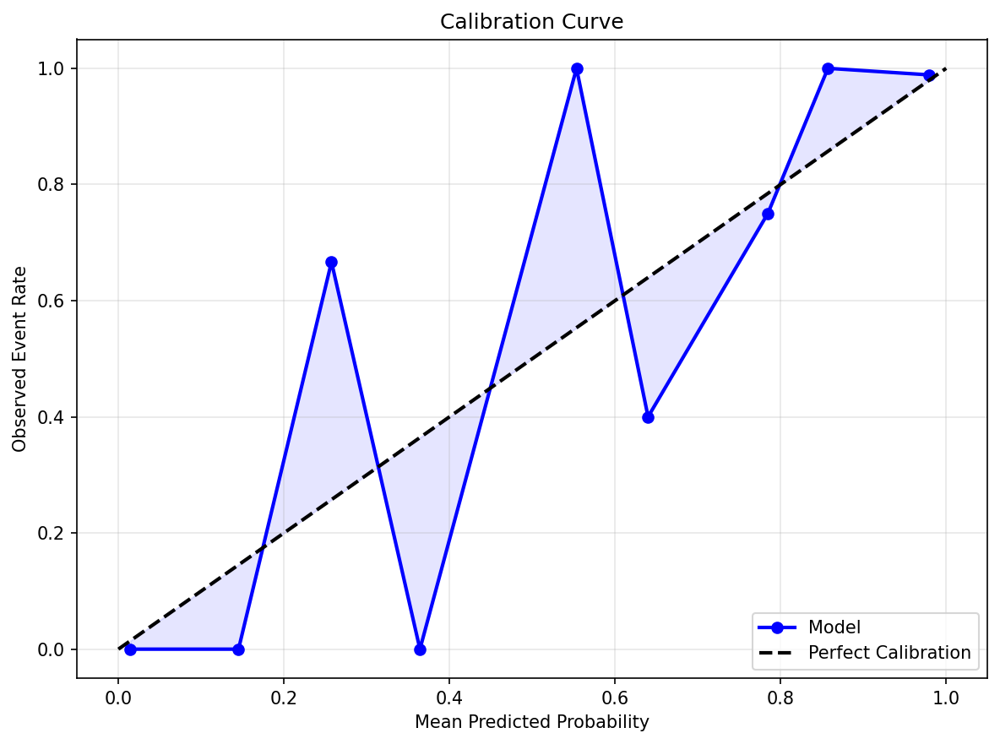

# Scorecard Model Report

## Summary Metrics

| Metric | Value |
|--------|-------|
| KS Statistic | 0.913 |
| AUC | 0.991 |
| Features | 4 |

## Model Performance

### Score Distribution: Good vs Bad

### KS Curve

### ROC Curve

### Cumulative Accuracy Profile (CAP)

## Feature Analysis

### Feature IV Ranking

## Scorecard

| Variable        | Bin              |        WOE |   Points |
|:----------------|:-----------------|-----------:|---------:|
| mean radius     | (-inf, 11.454]   |  2.58669   |   198.62 |
| mean radius     | (11.454, 12.744] |  1.91466   |   179.53 |
| mean radius     | (12.744, 14.042] |  0.930384  |   151.57 |
| mean radius     | (14.042, 17.072] | -0.838732  |   101.31 |
| mean radius     | (17.072, inf]    | -4.48112   |    -2.16 |
| mean texture    | (-inf, 15.674]   |  2.10856   |   191.88 |
| mean texture    | (15.674, 17.872] |  0.836854  |   151.63 |
| mean texture    | (17.872, 19.83]  | -0.090093  |   122.29 |
| mean texture    | (19.83, 21.976]  | -0.714054  |   102.54 |
| mean texture    | (21.976, inf]    | -1.17632   |    87.9  |
| mean smoothness | (-inf, 0.0841]   |  1.50758   |   168.96 |
| mean smoothness | (0.0841, 0.0913] |  0.490148  |   139.38 |
| mean smoothness | (0.0913, 0.0988] | -0.0588405 |   123.43 |
| mean smoothness | (0.0988, 0.107]  | -0.485824  |   111.02 |
| mean smoothness | (0.107, inf]     | -0.962811  |    97.15 |
| mean concavity  | (-inf, 0.0256]   |  3.45947   |   193.48 |
| mean concavity  | (0.0256, 0.045]  |  2.09523   |   166.53 |
| mean concavity  | (0.045, 0.0879]  |  1.01223   |   145.13 |
| mean concavity  | (0.0879, 0.15]   | -1.32854   |    98.89 |
| mean concavity  | (0.15, inf]      | -2.94982   |    66.87 |

### Scorecard Points Heatmap

## Calibration & Cutoff

### Calibration Curve

### Cutoff Optimization

