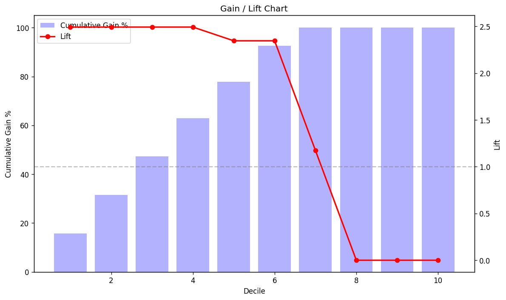
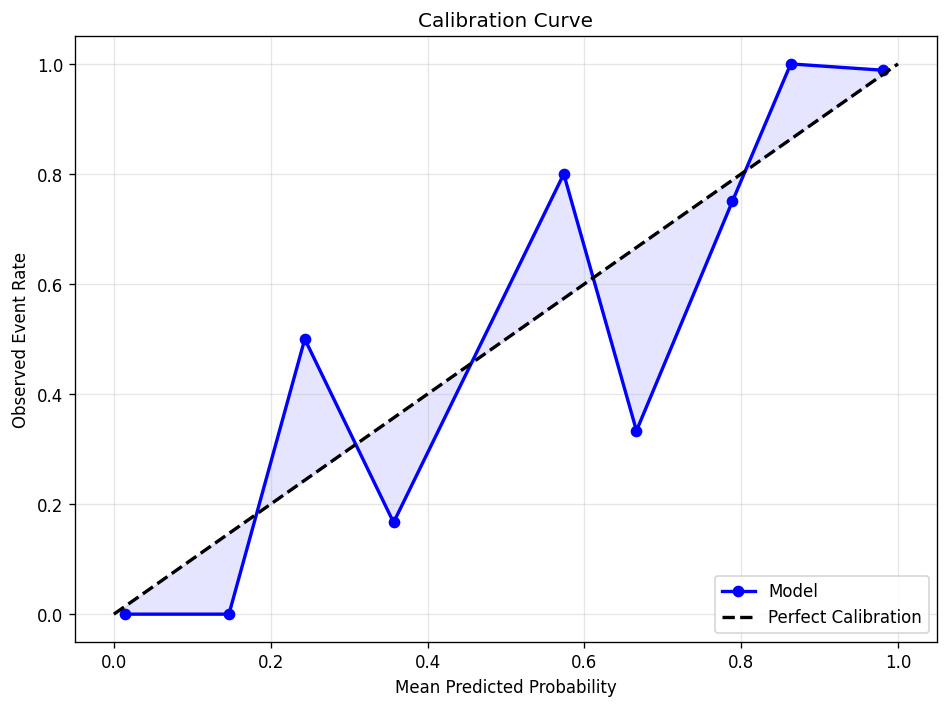
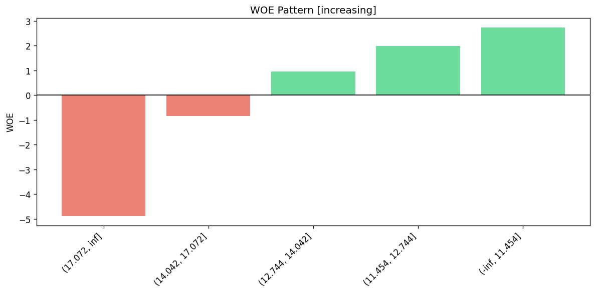
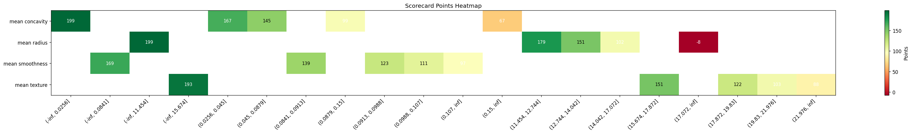
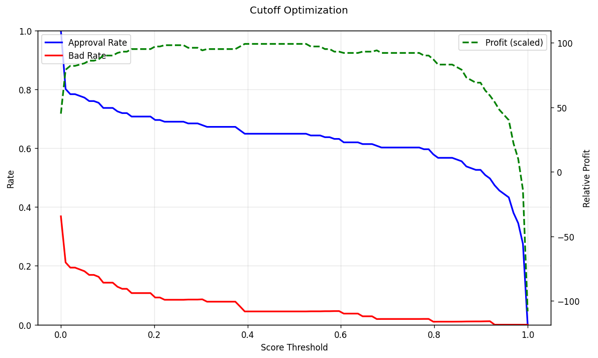
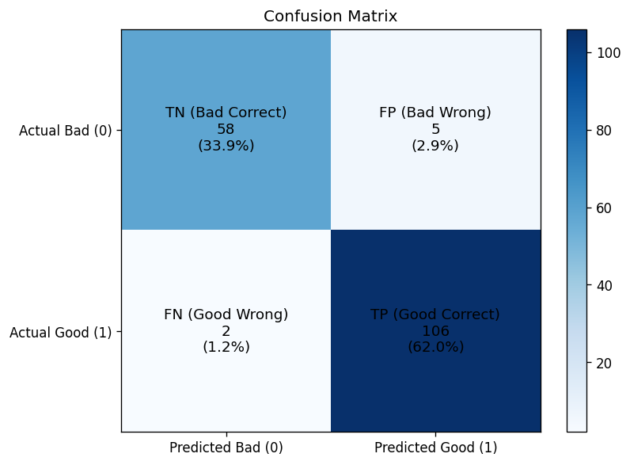

# Examples

## End-to-End Scorecard

```python
from sklearn.datasets import load_breast_cancer
from sklearn.model_selection import train_test_split
from ScoreCardModel import ScoreCardWrapper

data = load_breast_cancer()
X = pd.DataFrame(data.data, columns=data.feature_names)
y = pd.Series(data.target)

features = ['mean radius', 'mean texture', 'mean smoothness', 'mean concavity']
X = X[features]
X_train, X_test, y_train, y_test = train_test_split(
    X, y, test_size=0.3, random_state=42
)

sc = ScoreCardWrapper(binning_strategy='quantile', n_bins=5, base_points=600, pdo=20)
sc.fit(X_train, y_train)

scores = sc.predict(X_test)
print(scores.head())
```

Output:

```
204    556.594029
70     333.576797
131    420.456004
431    585.839711
540    627.256133
dtype: float64
```

Export scorecard table:

```python
card = sc.export_scorecard()
print(card.head(10))
```

Output:

```
       Variable               Bin       WOE  Points
0   mean radius    (-inf, 11.454]  2.731686  199.04
1   mean radius  (11.454, 12.744]  1.985193  178.78
2   mean radius  (12.744, 14.042]  0.952830  150.76
3   mean radius  (14.042, 17.072] -0.845640  101.95
4   mean radius     (17.072, inf] -4.882953   -7.62
5  mean texture    (-inf, 15.674]  2.194543  192.86
6  mean texture  (15.674, 17.872]  0.857039  151.44
7  mean texture   (17.872, 19.83] -0.087422  122.20
8  mean texture   (19.83, 21.976] -0.719359  102.63
9  mean texture     (21.976, inf] -1.187962   88.12
```

## Pipeline

```python
from sklearn.pipeline import Pipeline
from sklearn.linear_model import LogisticRegression
from ScoreCardModel import BinningTransformer, WOETransformer
from ScoreCardModel.analytics.metrics import calculate_ks

pipeline = Pipeline([
    ('binning', BinningTransformer(strategy='quantile', n_bins=5)),
    ('woe', WOETransformer(method='empirical_logit')),
    ('model', LogisticRegression())
])
pipeline.fit(X_train, y_train)

y_prob = pipeline.predict_proba(X_test)[:, 1]
ks = calculate_ks(y_test, y_prob)
print(f'KS: {ks:.3f}')
```

Output:

```
KS: 0.913
```

## Feature Selection

```python
from ScoreCardModel.analytics.selection import rank_features

ranking = rank_features(X_train, y_train)
print(ranking[ranking['IV'] > 0.02])
```

Output:

```
           Feature      IV  ... Chi2_pvalue Recommendation
0      mean radius  4.1629  ...         0.0    Investigate
1   mean concavity  3.7460  ...         0.0    Investigate
2     mean texture  1.1140  ...         0.0    Investigate
3  mean smoothness  0.6435  ...         0.0    Investigate
```

## Visualizations

All plots are generated from a model trained on the breast cancer dataset (4 features, quantile binning). The plots below are real output — not mockups.

### Model Discrimination

| KS Curve | ROC Curve | CAP Curve |
|---|---|---|
|  |  |  |

KS measures the maximum separation between good and bad populations. ROC shows the trade-off between TPR and FPR. CAP (Cumulative Accuracy Profile) shows the model's cumulative lift over random selection.

### Performance Diagnostics

| Gain / Lift | Score Distribution | Calibration |
|---|---|---|
|  |  |  |

Gain/Lift charts show how well the model ranks risk at each decile. Score distribution compares score profiles of good vs bad accounts. Calibration plots assess whether predicted probabilities match observed event rates.

### WOE and IV Analysis

| WOE Pattern | IV Summary |
|---|---|
|  |  |

WOE pattern plots show the relationship between bins and their Weight of Evidence. IV summary ranks features by Information Value for feature selection.

### Scorecard Interpretation

| Scorecard Waterfall | Scorecard Heatmap |
|---|---|
|  |  |

Waterfall charts show how each feature contributes to the final score. Heatmaps provide a bird's-eye view of the scorecard table.

### Decision Threshold

| Cutoff Optimization | Confusion Matrix |
|---|---|
|  |  |

Cutoff optimization identifies the optimal decision threshold by balancing cost/benefit. The confusion matrix shows classification performance at the chosen cutoff.

### Automated HTML Report

```python
from ScoreCardModel.analytics.reporting import generate_report

generate_report(pipeline, X_train, y_train, X_test, y_test,
                output_path="scorecard_report.html")
```

The report is a standalone, self-contained HTML file with all key plots, metrics, and the scorecard table — suitable for sharing with stakeholders or regulatory review.

[View Example Report](example_report.html)
