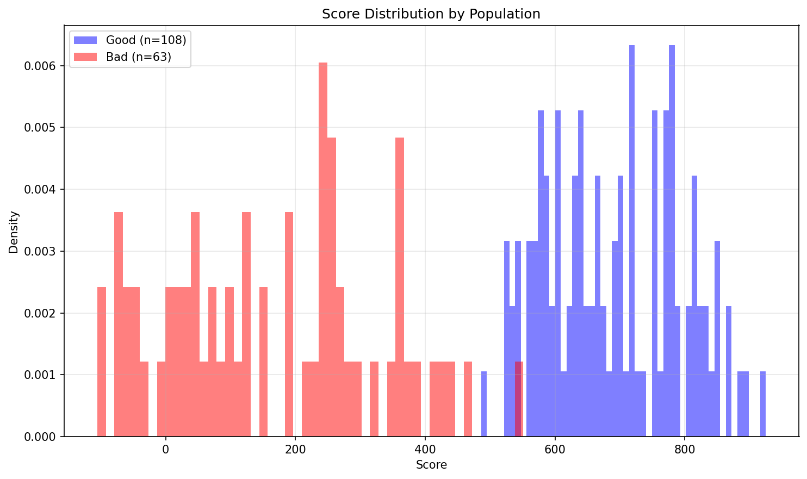
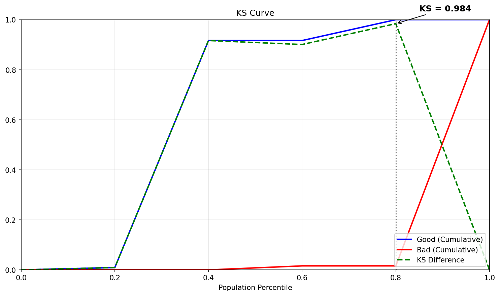
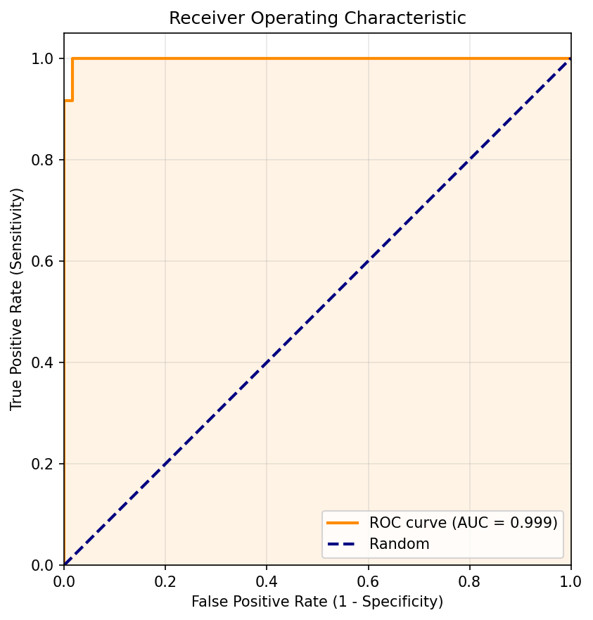
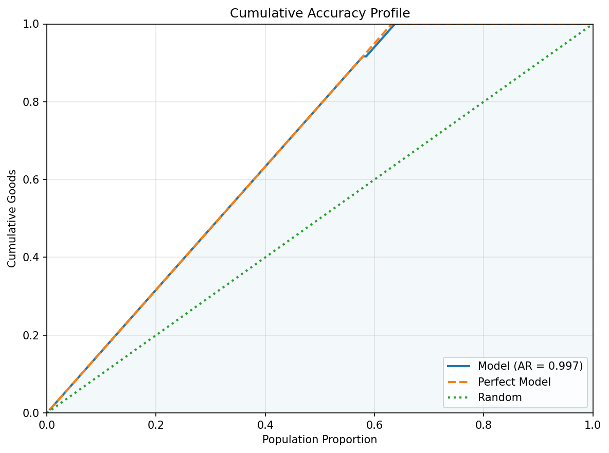
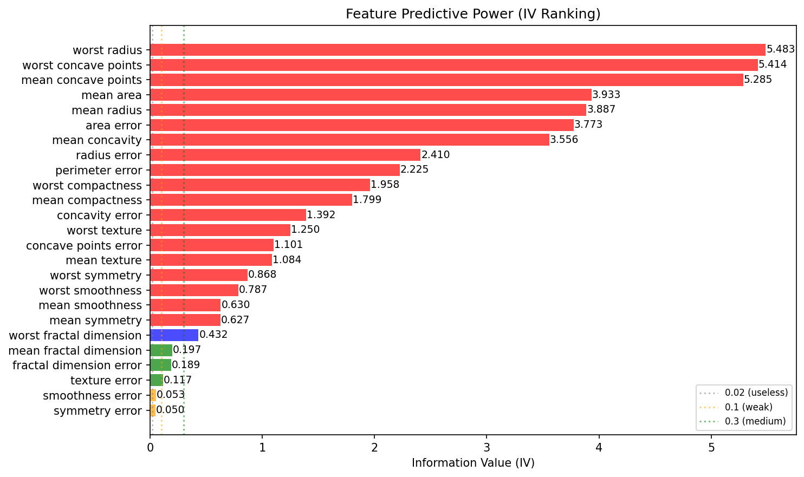
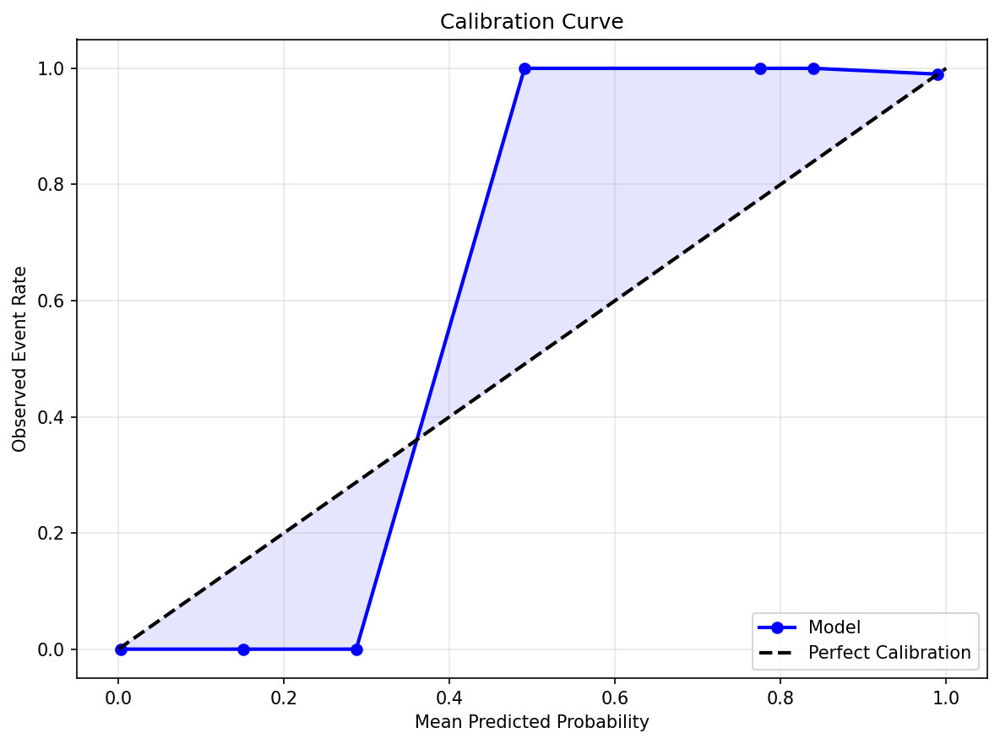
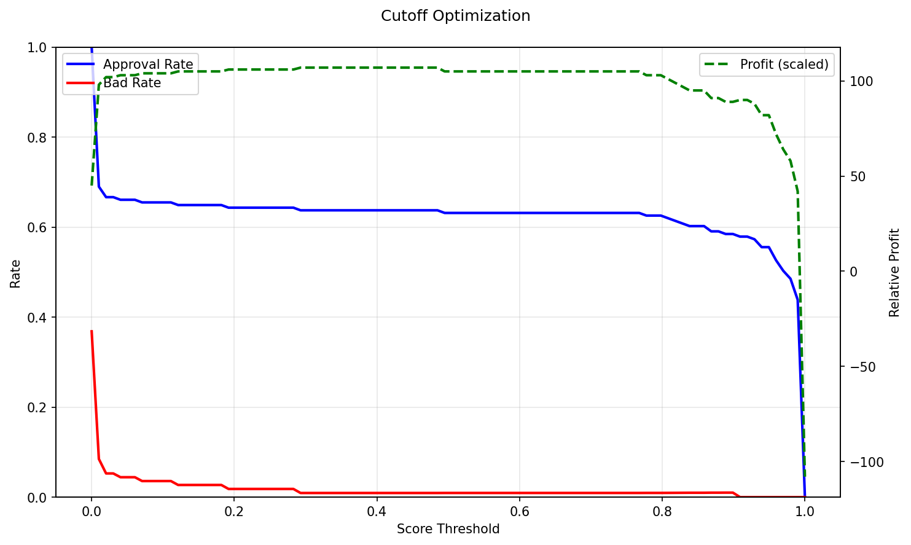

# Scorecard Model Report

## Executive Summary

This report evaluates a credit scorecard model built on 25 features using Logistic Regression with WOE transformation. The model achieves a KS statistic of **98.4%** and an AUC of **0.999** (Accuracy Ratio = 0.997), indicating very strong discriminatory power between good and bad accounts.

**KS = 98.4%** — the maximum separation between cumulative good and bad distributions. This is considered very strong (excellent) for credit scorecards.

**AUC = 0.999** — the probability that the model ranks a randomly chosen good account higher than a randomly chosen bad account. An AUC of 0.5 is random; values above 0.9 are excellent.

## Model Performance

The four plots below assess the model's ability to separate good from bad accounts across the entire score range.

### Score Distribution: Good vs Bad

Overlaid density of scores for good (blue) vs bad (red) accounts. Good separation means the two distributions have minimal overlap.

### KS Curve

Cumulative proportion of goods and bads as we move from high-risk to low-risk scores. The KS statistic is the maximum vertical distance between the two curves.

### ROC Curve

Trade-off between True Positive Rate (sensitivity) and False Positive Rate (1 - specificity). The diagonal line represents a random model.

### Cumulative Accuracy Profile (CAP)

Cumulative goods captured as a function of the population fraction, ordered by risk score. The Accuracy Ratio (AR) measures how far the model is from random toward perfect.

## Feature Analysis

Information Value (IV) measures each feature's predictive power. Industry-standard interpretation: <0.02 useless, 0.02–0.1 weak, 0.1–0.3 medium, 0.3–0.5 strong, >0.5 suspicious (investigate for data leakage).

The model uses 25 features with a total IV of **48.50**. The chart below ranks features by individual IV contribution.

### Feature IV Ranking

### Top Features by IV

| Feature              |      IV | Monotonicity   | Recommendation   |
|:---------------------|--------:|:---------------|:-----------------|
| worst radius         | 16.7758 | decreasing     | Investigate      |
| worst concave points | 12.6511 | decreasing     | Investigate      |
| mean concave points  |  9.7637 | decreasing     | Investigate      |
| mean area            |  4.2137 | decreasing     | Investigate      |
| mean radius          |  4.1629 | decreasing     | Investigate      |

## Scorecard

The scorecard translates model log-odds into interpretable point values. Each feature is binned, and each bin is assigned a WOE (Weight of Evidence) and a Points value. Higher points indicate lower risk (more "good"-like). The total score for an applicant is the sum of points across all features plus a base offset.

The table below shows the full scorecard (125 rows across 25 features).

| Variable                | Bin                |         WOE |   Points |
|:------------------------|:-------------------|------------:|---------:|
| worst fractal dimension | (-inf, 0.0695]     |  0.507098   |    16.26 |
| worst fractal dimension | (0.0695, 0.0768]   |  0.690441   |    15.12 |
| worst fractal dimension | (0.0768, 0.0831]   |  0.324742   |    17.39 |
| worst fractal dimension | (0.0831, 0.0951]   | -0.234073   |    20.86 |
| worst fractal dimension | (0.0951, inf]      | -1.12173    |    26.36 |
| mean fractal dimension  | (-inf, 0.0567]     | -0.609671   |     8.15 |
| mean fractal dimension  | (0.0567, 0.0601]   |  0.690441   |    32.15 |
| mean fractal dimension  | (0.0601, 0.0628]   | -0.0588405  |    18.32 |
| mean fractal dimension  | (0.0628, 0.0672]   |  0.324742   |    25.4  |
| mean fractal dimension  | (0.0672, inf]      | -0.234073   |    15.09 |
| fractal dimension error | (-inf, 0.00203]    |  0.571393   |    11.23 |
| fractal dimension error | (0.00203, 0.00278] |  0.490148   |    12.39 |
| fractal dimension error | (0.00278, 0.0036]  | -0.110502   |    20.99 |
| fractal dimension error | (0.0036, 0.00479]  | -0.535827   |    27.07 |
| fractal dimension error | (0.00479, inf]     | -0.312649   |    23.88 |
| texture error           | (-inf, 0.784]      |  0.571393   |    16.1  |
| texture error           | (0.784, 1.009]     | -0.284869   |    21.05 |
| texture error           | (1.009, 1.214]     | -0.262646   |    20.92 |
| texture error           | (1.214, 1.562]     | -0.234073   |    20.76 |
| texture error           | (1.562, inf]       |  0.266879   |    17.86 |
| smoothness error        | (-inf, 0.00487]    |  0.15467    |    21.59 |
| smoothness error        | (0.00487, 0.00587] | -0.182919   |    16.82 |
| smoothness error        | (0.00587, 0.00699] | -0.312649   |    14.99 |
| smoothness error        | (0.00699, 0.00878] |  0.0267574  |    19.78 |
| smoothness error        | (0.00878, inf]     |  0.324742   |    23.99 |
| symmetry error          | (-inf, 0.0147]     | -0.362406   |     8.3  |
| symmetry error          | (0.0147, 0.0172]   | -0.0792494  |    16.98 |
| symmetry error          | (0.0172, 0.0198]   |  0.100083   |    22.47 |
| symmetry error          | (0.0198, 0.0244]   |  0.306884   |    28.81 |
| symmetry error          | (0.0244, inf]      |  0.0463659  |    20.83 |
| worst radius            | (-inf, 12.774]     |  4.57058    |    39.51 |
| worst radius            | (12.774, 14.084]   |  2.30923    |    29.56 |
| worst radius            | (14.084, 15.946]   |  0.930384   |    23.5  |
| worst radius            | (15.946, 20.336]   | -1.04841    |    14.79 |
| worst radius            | (20.336, inf]      | -5.59223    |    -5.19 |
| worst concave points    | (-inf, 0.0579]     |  3.45947    |    91.26 |
| worst concave points    | (0.0579, 0.0843]   |  2.92316    |    80.12 |
| worst concave points    | (0.0843, 0.122]    |  1.02715    |    40.74 |
| worst concave points    | (0.122, 0.176]     | -1.19449    |    -5.4  |
| worst concave points    | (0.176, inf]       | -5.59223    |   -96.75 |
| mean concave points     | (-inf, 0.0179]     |  4.57058    |    78.32 |
| mean concave points     | (0.0179, 0.0278]   |  2.5737     |    52.58 |
| mean concave points     | (0.0278, 0.0481]   |  1.39341    |    37.37 |
| mean concave points     | (0.0481, 0.0847]   | -1.4491     |     0.73 |
| mean concave points     | (0.0847, inf]      | -4.48112    |   -38.35 |
| mean area               | (-inf, 402.86]     |  2.58669    |    44.62 |
| mean area               | (402.86, 498.2]    |  2.09523    |    39.83 |
| mean area               | (498.2, 607.18]    |  0.852479   |    27.72 |
| mean area               | (607.18, 916.24]   | -0.838732   |    11.23 |
| mean area               | (916.24, inf]      | -4.48112    |   -24.27 |
| mean radius             | (-inf, 11.454]     |  2.58669    |    34.93 |
| mean radius             | (11.454, 12.744]   |  1.91466    |    30.89 |
| mean radius             | (12.744, 14.042]   |  0.930384   |    24.99 |
| mean radius             | (14.042, 17.072]   | -0.838732   |    14.37 |
| mean radius             | (17.072, inf]      | -4.48112    |    -7.48 |
| area error              | (-inf, 17.018]     |  2.58669    |    51.73 |
| area error              | (17.018, 21.55]    |  1.75786    |    41.37 |
| area error              | (21.55, 28.904]    |  0.852479   |    30.06 |
| area error              | (28.904, 52.892]   | -0.736782   |    10.2  |
| area error              | (52.892, inf]      | -4.48112    |   -36.59 |
| mean concavity          | (-inf, 0.0256]     |  3.45947    |    89.38 |
| mean concavity          | (0.0256, 0.045]    |  2.09523    |    61.79 |
| mean concavity          | (0.045, 0.0879]    |  1.01223    |    39.88 |
| mean concavity          | (0.0879, 0.15]     | -1.32854    |    -7.47 |
| mean concavity          | (0.15, inf]        | -2.94982    |   -40.26 |
| radius error            | (-inf, 0.221]      |  2.32239    |   111.55 |
| radius error            | (0.221, 0.281]     |  0.997076   |    58.97 |
| radius error            | (0.281, 0.354]     |  0.571393   |    42.08 |
| radius error            | (0.354, 0.538]     | -0.335377   |     6.1  |
| radius error            | (0.538, inf]       | -3.13021    |  -104.79 |
| perimeter error         | (-inf, 1.536]      |  2.58669    |     7.53 |
| perimeter error         | (1.536, 2.052]     |  1.08369    |    14.43 |
| perimeter error         | (2.052, 2.588]     |  0.444686   |    17.36 |
| perimeter error         | (2.588, 3.767]     | -0.485824   |    21.64 |
| perimeter error         | (3.767, inf]       | -2.65435    |    31.59 |
| worst compactness       | (-inf, 0.126]      |  2.32239    |    32.49 |
| worst compactness       | (0.126, 0.184]     |  1.37913    |    27.17 |
| worst compactness       | (0.184, 0.252]     |  0.15467    |    20.28 |
| worst compactness       | (0.252, 0.365]     | -0.485824   |    16.67 |
| worst compactness       | (0.365, inf]       | -2.30981    |     6.4  |
| mean compactness        | (-inf, 0.0593]     |  2.10856    |   -41.8  |
| mean compactness        | (0.0593, 0.0788]   |  1.37913    |   -20.63 |
| mean compactness        | (0.0788, 0.109]    |  0.383959   |     8.26 |
| mean compactness        | (0.109, 0.144]     | -0.787579   |    42.27 |
| mean compactness        | (0.144, inf]       | -2.03388    |    78.45 |
| concavity error         | (-inf, 0.0134]     |  2.58669    |     1.06 |
| concavity error         | (0.0134, 0.021]    |  1.27366    |    10.37 |
| concavity error         | (0.021, 0.0306]    | -0.560218   |    23.38 |
| concavity error         | (0.0306, 0.0461]   | -0.838732   |    25.35 |
| concavity error         | (0.0461, inf]      | -0.911149   |    25.87 |
| worst texture           | (-inf, 20.098]     |  2.32239    |    99.44 |
| worst texture           | (20.098, 23.524]   |  0.997076   |    53.77 |
| worst texture           | (23.524, 26.502]   | -0.161641   |    13.84 |
| worst texture           | (26.502, 30.748]   | -0.736782   |    -5.99 |
| worst texture           | (30.748, inf]      | -1.23188    |   -23.05 |
| concave points error    | (-inf, 0.00692]    |  1.92817    |   -32.44 |
| concave points error    | (0.00692, 0.00991] |  0.997076   |    -7.4  |
| concave points error    | (0.00991, 0.0124]  | -0.00657897 |    19.58 |
| concave points error    | (0.0124, 0.0157]   | -0.838732   |    41.96 |
| concave points error    | (0.0157, inf]      | -1.17632    |    51.03 |
| mean texture            | (-inf, 15.674]     |  2.10856    |    61.53 |
| mean texture            | (15.674, 17.872]   |  0.836854   |    36.13 |
| mean texture            | (17.872, 19.83]    | -0.090093   |    17.61 |
| mean texture            | (19.83, 21.976]    | -0.714054   |     5.14 |
| mean texture            | (21.976, inf]      | -1.17632    |    -4.1  |
| worst symmetry          | (-inf, 0.243]      |  1.20477    |    53.81 |
| worst symmetry          | (0.243, 0.269]     |  0.746011   |    40.71 |
| worst symmetry          | (0.269, 0.294]     |  0.21023    |    25.41 |
| worst symmetry          | (0.294, 0.322]     | -0.234073   |    12.72 |
| worst symmetry          | (0.322, inf]       | -1.59304    |   -26.09 |
| worst smoothness        | (-inf, 0.112]      |  1.28815    |    54.69 |
| worst smoothness        | (0.112, 0.125]     |  0.690441   |    38.32 |
| worst smoothness        | (0.125, 0.137]     |  0.266879   |    26.72 |
| worst smoothness        | (0.137, 0.15]      | -0.485824   |     6.1  |
| worst smoothness        | (0.15, inf]        | -1.34639    |   -17.48 |
| mean smoothness         | (-inf, 0.0841]     |  1.50758    |    37.05 |
| mean smoothness         | (0.0841, 0.0913]   |  0.490148   |    25.14 |
| mean smoothness         | (0.0913, 0.0988]   | -0.0588405  |    18.72 |
| mean smoothness         | (0.0988, 0.107]    | -0.485824   |    13.72 |
| mean smoothness         | (0.107, inf]       | -0.962811   |     8.13 |
| mean symmetry           | (-inf, 0.158]      |  1.19028    |    12.08 |
| mean symmetry           | (0.158, 0.172]     |  0.915      |    13.78 |
| mean symmetry           | (0.172, 0.185]     | -0.212333   |    20.71 |
| mean symmetry           | (0.185, 0.199]     | -0.485824   |    22.39 |
| mean symmetry           | (0.199, inf]       | -0.962811   |    25.33 |

### Scorecard Points Heatmap

The heatmap provides a bird's-eye view of the scorecard. Green cells = higher points (lower risk), red cells = lower points (higher risk). Consistent color gradients within each feature indicate good monotonicity.

## Calibration & Cutoff

The base event rate in the test set is **63.2%**. The plots below assess probability calibration and help select an optimal decision threshold.

### Calibration Curve

Compares predicted probabilities against observed event rates. A well-calibrated model follows the diagonal. Points above the line mean the model underestimates risk; below the line means it overestimates.

### Cutoff Optimization

Shows how approval rate, bad rate, and relative profit change with the score cutoff. The optimal cutoff balances the cost of false positives (approving a bad account) against false negatives (rejecting a good account).

