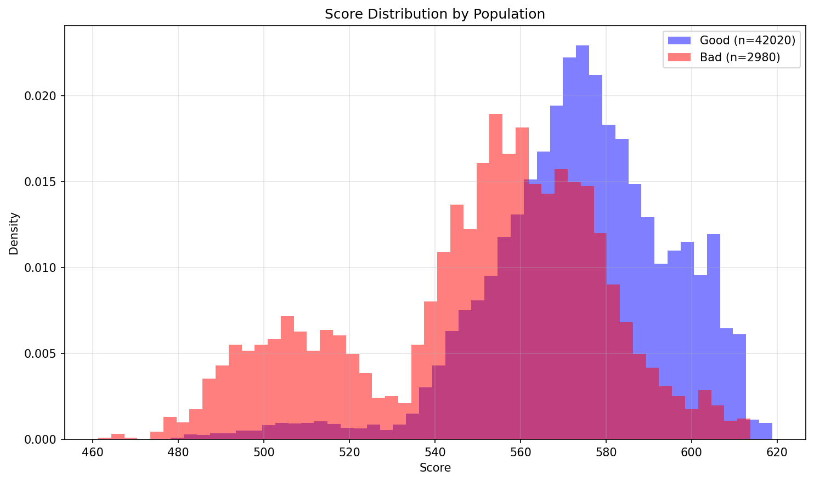
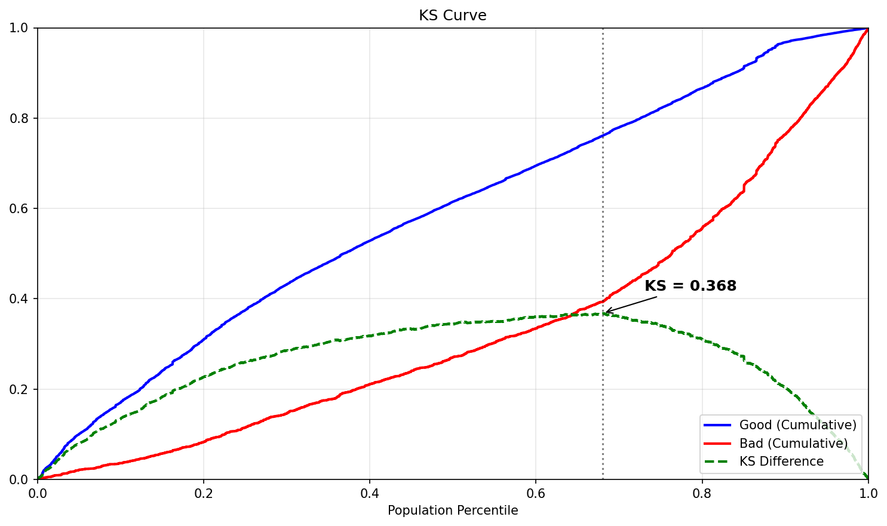
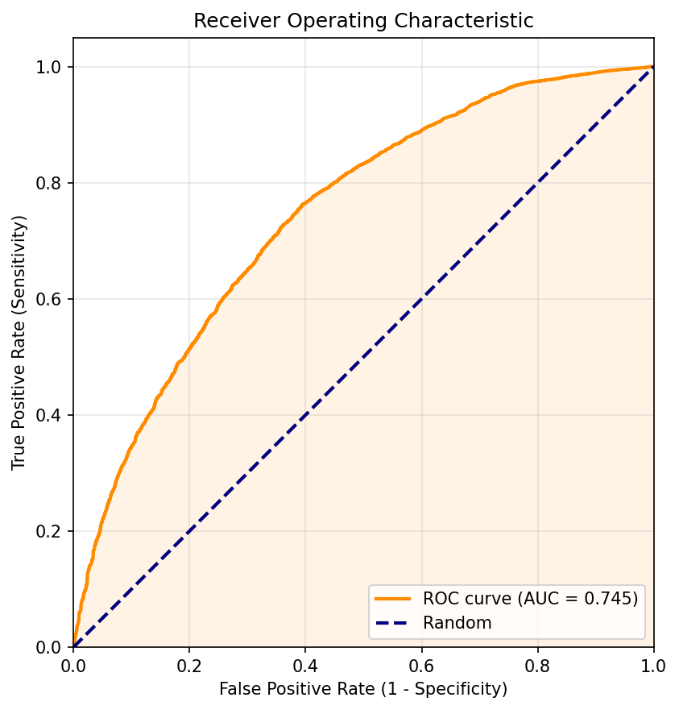
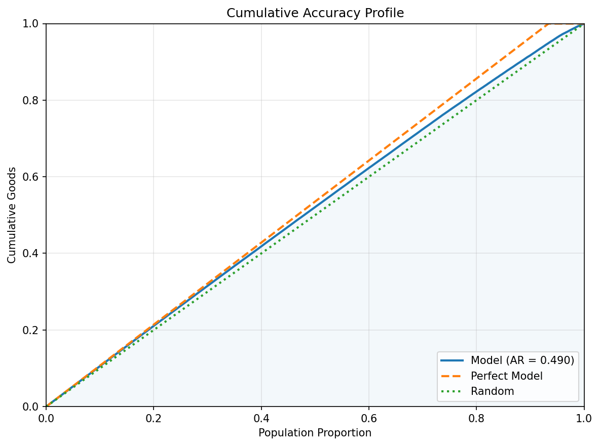
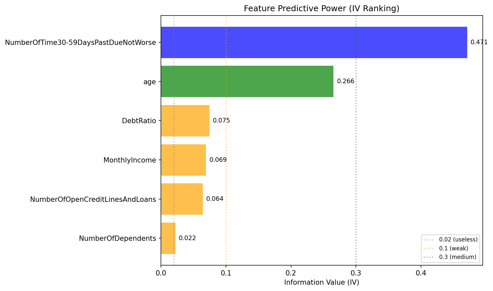
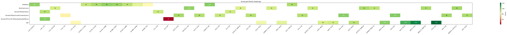
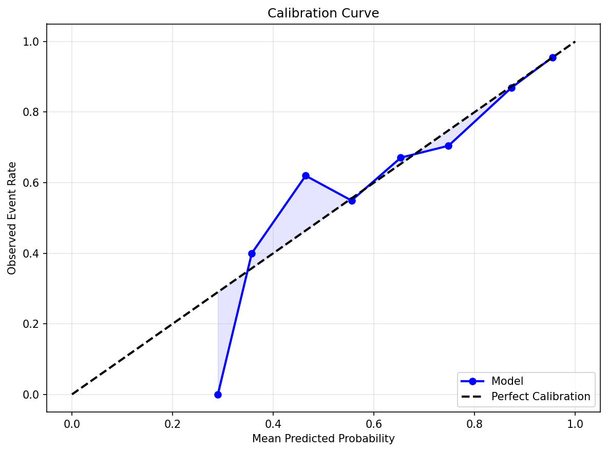
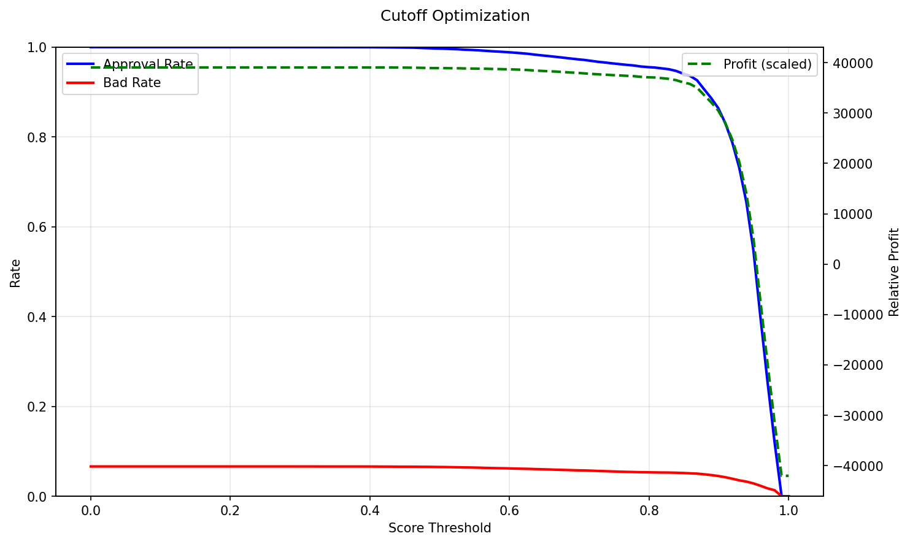

# Scorecard Model Report

## Executive Summary

This report evaluates a credit scorecard model built on 6 features using Logistic Regression with WOE transformation. The model achieves a KS statistic of **36.8%** and an AUC of **0.745** (Accuracy Ratio = 0.490), indicating reasonable discriminatory power between good and bad accounts.

**KS = 36.8%** — the maximum separation between cumulative good and bad distributions. This is considered moderate (acceptable) for credit scorecards.

**AUC = 0.745** — the probability that the model ranks a randomly chosen good account higher than a randomly chosen bad account. An AUC of 0.5 is random; values above 0.9 are excellent.

## Model Performance

The four plots below assess the model's ability to separate good from bad accounts across the entire score range.

### Score Distribution: Good vs Bad

Overlaid density of scores for good (blue) vs bad (red) accounts. Good separation means the two distributions have minimal overlap.

### KS Curve

Cumulative proportion of goods and bads as we move from high-risk to low-risk scores. The KS statistic is the maximum vertical distance between the two curves.

### ROC Curve

Trade-off between True Positive Rate (sensitivity) and False Positive Rate (1 - specificity). The diagonal line represents a random model.

### Cumulative Accuracy Profile (CAP)

Cumulative goods captured as a function of the population fraction, ordered by risk score. The Accuracy Ratio (AR) measures how far the model is from random toward perfect.

## Feature Analysis

Information Value (IV) measures each feature's predictive power. Industry-standard interpretation: <0.02 useless, 0.02–0.1 weak, 0.1–0.3 medium, 0.3–0.5 strong, >0.5 suspicious (investigate for data leakage).

The model uses 6 features with a total IV of **0.97**. The chart below ranks features by individual IV contribution.

### Feature IV Ranking

### Top Features by IV

| Feature                              |     IV | Monotonicity   | Recommendation   |
|:-------------------------------------|-------:|:---------------|:-----------------|
| NumberOfTime30-59DaysPastDueNotWorse | 0.4713 | single_bin     | Accept           |
| age                                  | 0.2658 | increasing     | Accept           |
| DebtRatio                            | 0.0747 | non-monotonic  | Accept           |
| MonthlyIncome                        | 0.0694 | non-monotonic  | Accept           |
| NumberOfOpenCreditLinesAndLoans      | 0.0644 | non-monotonic  | Accept           |

## Scorecard

The scorecard translates model log-odds into interpretable point values. Each feature is binned, and each bin is assigned a WOE (Weight of Evidence) and a Points value. Higher points indicate lower risk (more "good"-like). The total score for an applicant is the sum of points across all features plus a base offset.

The table below shows the full scorecard (44 rows across 6 features).

| Variable                             | Bin               |         WOE |   Points |
|:-------------------------------------|:------------------|------------:|---------:|
| NumberOfTime30-59DaysPastDueNotWorse | (-inf, 1.0]       |  0.259055   |   101.04 |
| NumberOfTime30-59DaysPastDueNotWorse | (1.0, inf]        | -1.89011    |    41.44 |
| age                                  | (-inf, 33.0]      | -0.597861   |    79.87 |
| age                                  | (33.0, 39.0]      | -0.396785   |    84.57 |
| age                                  | (39.0, 44.0]      | -0.281745   |    87.26 |
| age                                  | (44.0, 48.0]      | -0.202875   |    89.11 |
| age                                  | (48.0, 52.0]      | -0.141151   |    90.55 |
| age                                  | (52.0, 56.0]      |  0.0222607  |    94.37 |
| age                                  | (56.0, 61.0]      |  0.296845   |   100.79 |
| age                                  | (61.0, 65.0]      |  0.639576   |   108.81 |
| age                                  | (65.0, 72.0]      |  0.965176   |   116.42 |
| age                                  | (72.0, inf]       |  1.18905    |   121.66 |
| DebtRatio                            | (-inf, 0.0311]    |  0.251202   |    99.79 |
| DebtRatio                            | (0.0311, 0.134]   | -0.0516791  |    92.63 |
| DebtRatio                            | (0.134, 0.214]    |  0.103801   |    96.31 |
| DebtRatio                            | (0.214, 0.288]    |  0.236124   |    99.44 |
| DebtRatio                            | (0.288, 0.367]    |  0.197482   |    98.52 |
| DebtRatio                            | (0.367, 0.468]    |  0.00955136 |    94.08 |
| DebtRatio                            | (0.468, 0.649]    | -0.278574   |    87.26 |
| DebtRatio                            | (0.649, 4.0]      | -0.563055   |    80.53 |
| DebtRatio                            | (1262.0, inf]     |  0.309529   |   101.17 |
| DebtRatio                            | (4.0, 1262.0]     |  0.0955409  |    96.11 |
| MonthlyIncome                        | (-inf, 2313.9]    | -0.256753   |    90.31 |
| MonthlyIncome                        | (10733.2, inf]    |  0.447894   |   100.03 |
| MonthlyIncome                        | (2313.9, 3400.0]  | -0.388434   |    88.5  |
| MonthlyIncome                        | (3400.0, 4333.0]  | -0.249095   |    90.42 |
| MonthlyIncome                        | (4333.0, 5375.0]  | -0.133267   |    92.01 |
| MonthlyIncome                        | (5375.0, 5400.0]  |  0.188451   |    96.45 |
| MonthlyIncome                        | (5400.0, 6612.3]  | -0.00596297 |    93.77 |
| MonthlyIncome                        | (6612.3, 8265.0]  |  0.219501   |    96.88 |
| MonthlyIncome                        | (8265.0, 10733.2] |  0.289711   |    97.85 |
| NumberOfOpenCreditLinesAndLoans      | (-inf, 3.0]       | -0.504524   |    78.01 |
| NumberOfOpenCreditLinesAndLoans      | (10.0, 12.0]      |  0.10752    |    97.23 |
| NumberOfOpenCreditLinesAndLoans      | (12.0, 15.0]      |  0.0550459  |    95.58 |
| NumberOfOpenCreditLinesAndLoans      | (15.0, inf]       | -0.0324435  |    92.83 |
| NumberOfOpenCreditLinesAndLoans      | (3.0, 4.0]        |  0.0287033  |    94.75 |
| NumberOfOpenCreditLinesAndLoans      | (4.0, 5.0]        |  0.042272   |    95.18 |
| NumberOfOpenCreditLinesAndLoans      | (5.0, 6.0]        |  0.230378   |   101.09 |
| NumberOfOpenCreditLinesAndLoans      | (6.0, 8.0]        |  0.253156   |   101.8  |
| NumberOfOpenCreditLinesAndLoans      | (8.0, 9.0]        |  0.135356   |    98.1  |
| NumberOfOpenCreditLinesAndLoans      | (9.0, 10.0]       |  0.0966691  |    96.89 |
| NumberOfDependents                   | (-inf, 1.0]       |  0.0834006  |    94.55 |
| NumberOfDependents                   | (1.0, 2.0]        | -0.206915   |    92.11 |
| NumberOfDependents                   | (2.0, inf]        | -0.324932   |    91.12 |

### Scorecard Points Heatmap

The heatmap provides a bird's-eye view of the scorecard. Green cells = higher points (lower risk), red cells = lower points (higher risk). Consistent color gradients within each feature indicate good monotonicity.

## Calibration & Cutoff

The base event rate in the test set is **93.4%**. The plots below assess probability calibration and help select an optimal decision threshold.

### Calibration Curve

Compares predicted probabilities against observed event rates. A well-calibrated model follows the diagonal. Points above the line mean the model underestimates risk; below the line means it overestimates.

### Cutoff Optimization

Shows how approval rate, bad rate, and relative profit change with the score cutoff. The optimal cutoff balances the cost of false positives (approving a bad account) against false negatives (rejecting a good account).

