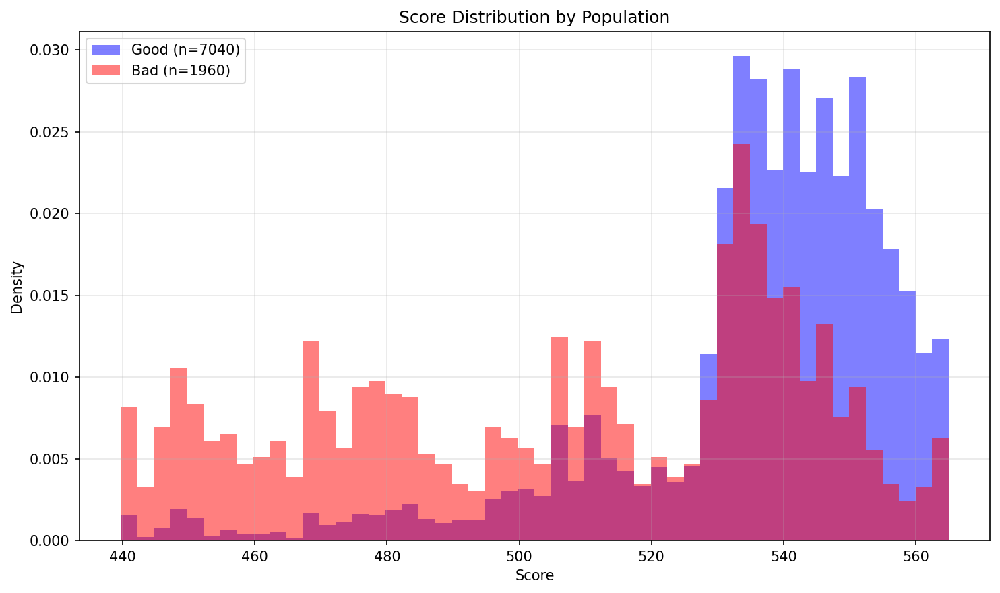
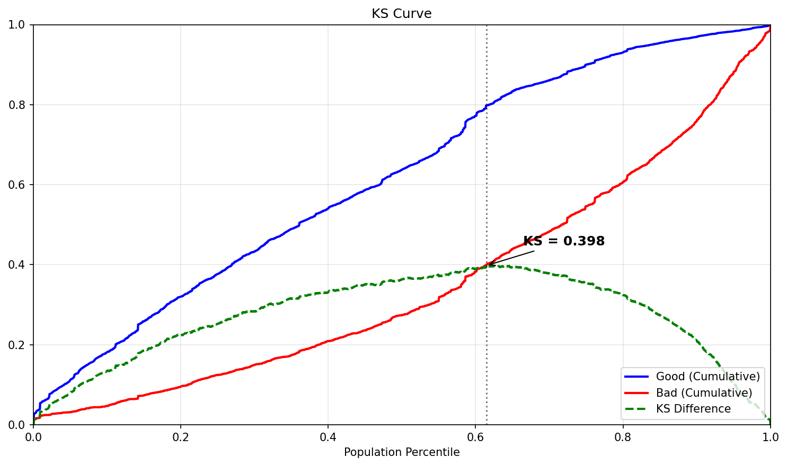
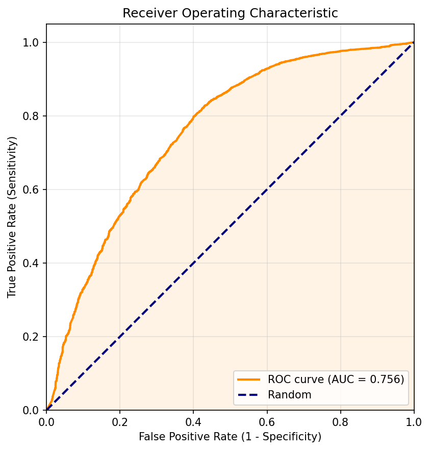
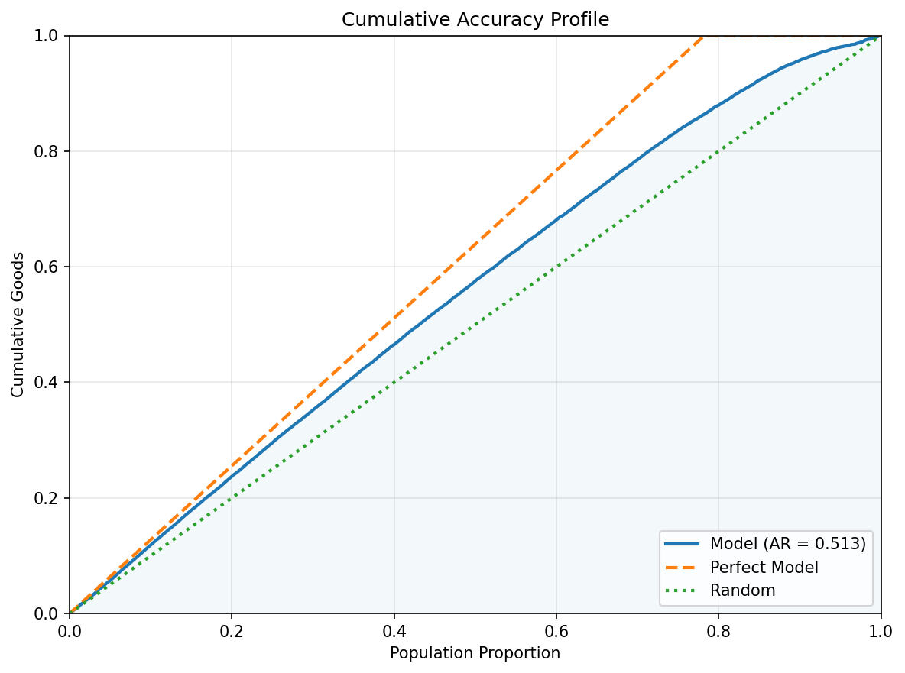
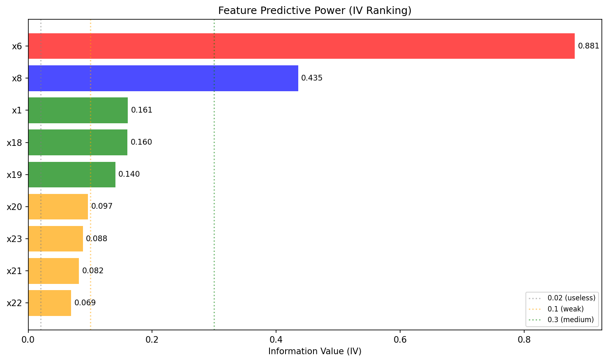
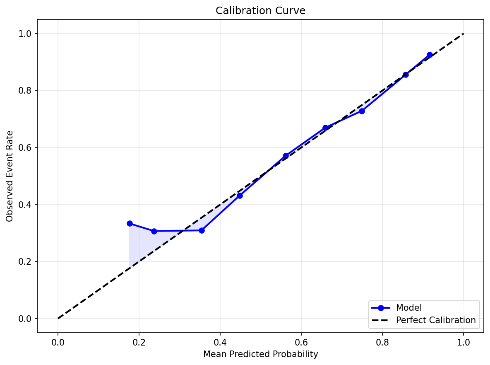
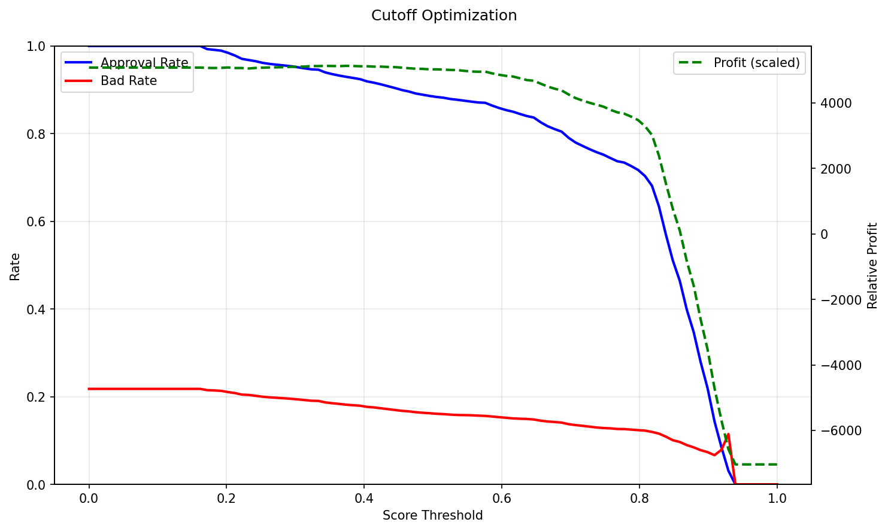

# Scorecard Model Report

## Executive Summary

This report evaluates a credit scorecard model built on 9 features using Logistic Regression with WOE transformation. The model achieves a KS statistic of **39.8%** and an AUC of **0.756** (Accuracy Ratio = 0.513), indicating reasonable discriminatory power between good and bad accounts.

**KS = 39.8%** — the maximum separation between cumulative good and bad distributions. This is considered moderate (acceptable) for credit scorecards.

**AUC = 0.756** — the probability that the model ranks a randomly chosen good account higher than a randomly chosen bad account. An AUC of 0.5 is random; values above 0.9 are excellent.

## Model Performance

The four plots below assess the model's ability to separate good from bad accounts across the entire score range.

### Score Distribution: Good vs Bad

Overlaid density of scores for good (blue) vs bad (red) accounts. Good separation means the two distributions have minimal overlap.

### KS Curve

Cumulative proportion of goods and bads as we move from high-risk to low-risk scores. The KS statistic is the maximum vertical distance between the two curves.

### ROC Curve

Trade-off between True Positive Rate (sensitivity) and False Positive Rate (1 - specificity). The diagonal line represents a random model.

### Cumulative Accuracy Profile (CAP)

Cumulative goods captured as a function of the population fraction, ordered by risk score. The Accuracy Ratio (AR) measures how far the model is from random toward perfect.

## Feature Analysis

Information Value (IV) measures each feature's predictive power. Industry-standard interpretation: <0.02 useless, 0.02–0.1 weak, 0.1–0.3 medium, 0.3–0.5 strong, >0.5 suspicious (investigate for data leakage).

The model uses 9 features with a total IV of **2.11**. The chart below ranks features by individual IV contribution.

### Feature IV Ranking

### Top Features by IV

| Feature   |     IV | Monotonicity   | Recommendation   |
|:----------|-------:|:---------------|:-----------------|
| x6        | 0.8816 | decreasing     | Investigate      |
| x8        | 0.4354 | non-monotonic  | Accept           |
| x1        | 0.1609 | non-monotonic  | Accept           |
| x18       | 0.1602 | non-monotonic  | Accept           |
| x19       | 0.1405 | non-monotonic  | Accept           |

## Scorecard

The scorecard translates model log-odds into interpretable point values. Each feature is binned, and each bin is assigned a WOE (Weight of Evidence) and a Points value. Higher points indicate lower risk (more "good"-like). The total score for an applicant is the sum of points across all features plus a base offset.

The table below shows the full scorecard (38 rows across 9 features).

| Variable   | Bin                  |         WOE |   Points |
|:-----------|:---------------------|------------:|---------:|
| x8         | (-1.0, 0.0]          |  0.304362   |    62.04 |
| x8         | (-inf, -1.0]         |  0.35361    |    62.67 |
| x8         | (0.0, inf]           | -1.39383    |    40.22 |
| x1         | (-inf, 50000.0]      | -0.520152   |    51.85 |
| x1         | (100000.0, 180000.0] |  0.159326   |    60.05 |
| x1         | (180000.0, 270000.0] |  0.301749   |    61.77 |
| x1         | (270000.0, inf]      |  0.589377   |    65.24 |
| x1         | (50000.0, 100000.0]  | -0.165176   |    56.13 |
| x18        | (-inf, 316.0]        | -0.638325   |    52.43 |
| x18        | (1714.0, 3000.0]     |  0.0424854  |    58.5  |
| x18        | (3000.0, 6159.8]     |  0.243802   |    60.3  |
| x18        | (316.0, 1714.0]      |  0.0103584  |    58.22 |
| x18        | (6159.8, inf]        |  0.560591   |    63.13 |
| x19        | (-inf, 300.0]        | -0.547061   |    57.54 |
| x19        | (1600.0, 3000.0]     |  0.04374    |    58.17 |
| x19        | (300.0, 1600.0]      | -0.0925032  |    58.03 |
| x19        | (3000.0, 6000.0]     |  0.185429   |    58.32 |
| x19        | (6000.0, inf]        |  0.620864   |    58.79 |
| x20        | (-inf, 1200.0]       | -0.300007   |    56.87 |
| x20        | (1200.0, 2496.2]     | -0.025955   |    58.02 |
| x20        | (2496.2, 5290.2]     |  0.252946   |    59.18 |
| x20        | (5290.2, inf]        |  0.514082   |    60.27 |
| x23        | (-inf, 1000.0]       | -0.25577    |    56.61 |
| x23        | (1000.0, 2100.0]     | -0.0506321  |    57.83 |
| x23        | (2100.0, 5000.0]     |  0.186058   |    59.22 |
| x23        | (5000.0, inf]        |  0.562283   |    61.45 |
| x21        | (-inf, 1000.0]       | -0.269853   |    56.77 |
| x21        | (1000.0, 2100.0]     | -0.00846178 |    58.08 |
| x21        | (2100.0, 5000.0]     |  0.234317   |    59.3  |
| x21        | (5000.0, inf]        |  0.475088   |    60.51 |
| x22        | (-inf, 1000.0]       | -0.243782   |    57.48 |
| x22        | (1000.0, 2133.4]     | -0.0282874  |    58.05 |
| x22        | (2133.4, 5000.0]     |  0.195425   |    58.65 |
| x22        | (5000.0, inf]        |  0.454926   |    59.34 |
| x6         | (-1.0, 0.0]          |  0.671224   |    73.58 |
| x6         | (-inf, -1.0]         |  0.417056   |    67.73 |
| x6         | (0.0, 1.0]           | -0.58762    |    44.59 |
| x6         | (1.0, inf]           | -2.09263    |     9.93 |

### Scorecard Points Heatmap

The heatmap provides a bird's-eye view of the scorecard. Green cells = higher points (lower risk), red cells = lower points (higher risk). Consistent color gradients within each feature indicate good monotonicity.

## Calibration & Cutoff

The base event rate in the test set is **78.2%**. The plots below assess probability calibration and help select an optimal decision threshold.

### Calibration Curve

Compares predicted probabilities against observed event rates. A well-calibrated model follows the diagonal. Points above the line mean the model underestimates risk; below the line means it overestimates.

### Cutoff Optimization

Shows how approval rate, bad rate, and relative profit change with the score cutoff. The optimal cutoff balances the cost of false positives (approving a bad account) against false negatives (rejecting a good account).

